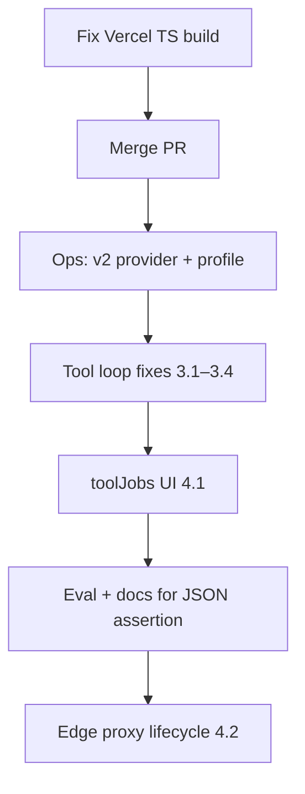

# Devs.ai v2 — Gap Remediation Plan

Branch: `feature/devs-ai-v2` · PR: [#1](https://github.com/jleggo-dev/ai-manager/pull/1)

This plan covers remaining work after the initial v2 integration (Phases A–C). Cadence is out of scope.

---

## 1. JSON / structured output assertion (confirmed)

**You can assert JSON from devs.ai today** in both the UI and API. Mechanisms differ by provider generation.

| Layer | UI | API | devs-ai v1 | devs-ai-v2 |
|-------|----|-----|------------|------------|
| **Native provider schema** | Processing Job → **Expected Schema** editor (Build Rules tab + rule sets) | `config.expectedSchema` on `POST/PATCH /api/processing-jobs` | No (prompt + rules only) | **Yes** — `expectedSchema.fields` → `text.format.json_schema` via `expectedSchemaFieldsToJsonSchema()` |
| **Post-hoc validation** | Build Rules: `trim-to-json`, `repair-json`, `assert-json-schema`, `require-keys` | Same rules in job `config.formattingRules` | Yes | Optional (UI banner de-emphasizes when v2 + native schema) |
| **Golden tests** | Job eval UI / test runner | `POST /api/processing-jobs/:id/eval` | Yes | Yes |
| **Response format hint** | `expectedResponseFormat: "json"` on job | Same in job config | Yes | Yes |

### v2 execution path

1. Job has `config.expectedSchema.fields` (field descriptors: `type`, `description`, `required`, etc.).
2. `executeJobById` passes schema through `buildProviderChatOptions({ expectedSchema })` when `provider_type === 'devs-ai-v2'`.
3. v2 client sets `text.format.type = json_schema` with strict mode — **provider enforces** shape before returning.
4. When native schema is active and `applyFormattingRules` is false, JSON build rules are skipped (no double-validation).

### Chat sessions

- Linked processing job’s `expectedSchema` is forwarded to v2 on chat when the session profile uses `devs-ai-v2`.
- Tool jobs and chat do not add a separate “assert JSON” toggle; use job `expectedSchema` + optional formatting rules.

### Gaps (JSON-specific)

| Gap | Priority | Action |
|-----|----------|--------|
| Docs don’t call out v2 native vs v1 rules path in one place | P2 | Add subsection to `docs/INTEGRATION.md` “Structured output” |
| No runtime toggle “force formatting rules even with v2 schema” in UI | P3 | Expose `applyFormattingRules` on job config if needed |
| Eval doesn’t run `assert-json-schema` against full schema tree | P2 | Extend `runJobEval` to use `validateResponseSchema` when `expectedSchema` present |

---

## 2. Vercel build errors (fixed)

| File | Issue | Fix |
|------|-------|-----|
| `backend/src/ai-manager/index.ts` | `JobConfig.expectedSchema.fields` typed as `Record<string, unknown>` | Align `JobConfig` with `ExpectedSchemaInput` from `expected-schema-to-json-schema.ts` |
| `backend/src/integrations/devs-ai-v2/client.ts` | `role` on `ChatCompletionChoice.message` | Omit `role` (interface is `{ content: string }` only) |
| `backend/src/integrations/devs-ai-v2/sse-transform.ts` | Duplicate `type` in spread | Destructure `type` out of `parsed` before re-adding |
| `backend/test/e2e-devs-ai-v2-tools.test.ts` | `v2Provider` possibly undefined | Guard `if (!v2Provider) return undefined` after provision block |

**Verify:** `npm run build --workspace=backend` (and root `npm run build` if Vercel builds monorepo).

---

## 3. Jobs-as-tools reliability (P0 — before production tool use)

| # | Gap | Status |
|---|-----|--------|
| 3.1 | Post-tool continuation stream accumulated into `fullContent` / `recordAssistantMessage` | **Done** — `runInternalToolJobLoop` + content computed after tool rounds |
| 3.2 | `provider_metadata` updated after tool continuation | **Done** — `onV2Metadata` in tool loop |
| 3.3 | Function-call metadata on `response.completed` | **Done** — `sse-transform` emits `output_item.done` + `v2-stream-events` |
| 3.4 | `sendChatMessage` uses refreshed profile for tools | **Done** — `refreshedSession.ai_profile` |
| 3.5 | Live E2E asserts persisted assistant message | **Done** — checks DB message contains PONG |

## 4. Product / UX gaps

| # | Gap | Status |
|---|-----|--------|
| 4.1 | UI for `toolJobs` on AI profiles | **Done** — `AiProfileManager` Jobs as tools section |
| 4.2 | Edge proxy cancel / reconnect-stream | **Done** — `cancel-chat-session`, `reconnect-chat-stream` modes |
| 4.3 | v2 lifecycle for embedders | **Done** — documented in `INTEGRATION.md` |

### JSON gaps

| Gap | Status |
|-----|--------|
| Structured output docs | **Done** — `INTEGRATION.md` §15 |
| `applyFormattingRules` UI toggle | **Done** — Build Rules tab switch |
| Eval `expectedSchema` validation | **Done** — `expected-schema-validation.ts` + `job-eval.ts` |

---

## 5. Operational checklist (P1 — merge / deploy)

- [ ] Merge PR #1 after build green on Vercel
- [ ] Create persistent `devs-ai-v2` provider in workspace (or migrate from v1)
- [ ] Run **Sync models** on v2 provider
- [ ] Create chat AI profile on v2 model; set runtime options (`store`, reasoning, etc.)
- [ ] Apply migration `012_chat_session_provider_metadata.sql` on production Supabase if not already applied
- [ ] Smoke: provider test, one structured job, one chat session, optional tool job
- [ ] Rotate / confirm `DEVS_AI_API_KEY` in Vercel env

---

## 6. Suggested implementation order

1. **Now:** Build fixes (§2) — unblock deploy  
2. **Pre-merge or fast-follow:** Tool loop 3.1–3.4 if jobs-as-tools are required at launch  
3. **Next sprint:** toolJobs UI, eval schema validation, integration docs  
4. **Later:** Edge proxy, `applyFormattingRules` toggle, chat stop button  

---

## 7. Out of scope (this plan)

- Cadence apps (`apps/cadence-*`, `config/ai-admin` Cadence jobs)
- Devs.ai v1 deprecation / provider UUID migration
- Embedding / vector retrieval

---

## 8. Acceptance criteria

| Area | Done when |
|------|-----------|
| Build | `npm run build` passes locally and on Vercel |
| JSON assertion | Job with `expectedSchema` on v2 provider returns parseable JSON matching fields; eval/test/documented |
| Tools | Chat with `toolJobs` completes job server-side; assistant message and metadata persisted after continuation |
| Ops | Documented provider + profile exist; models synced; migration applied |
